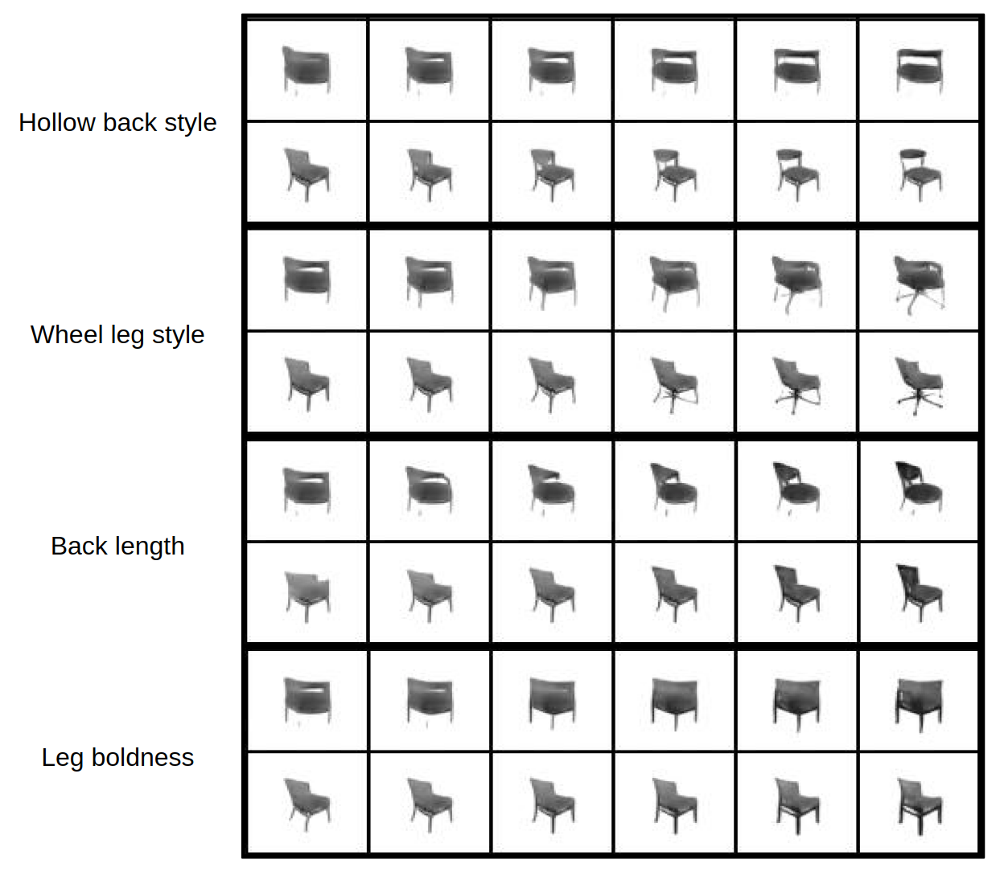
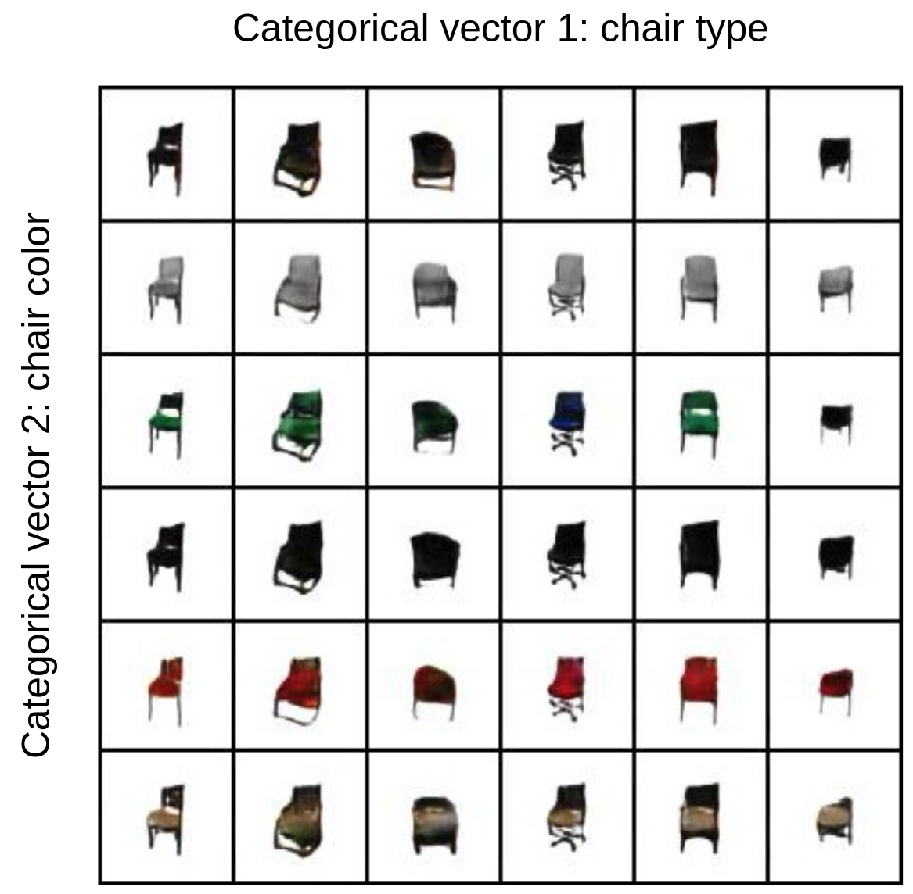
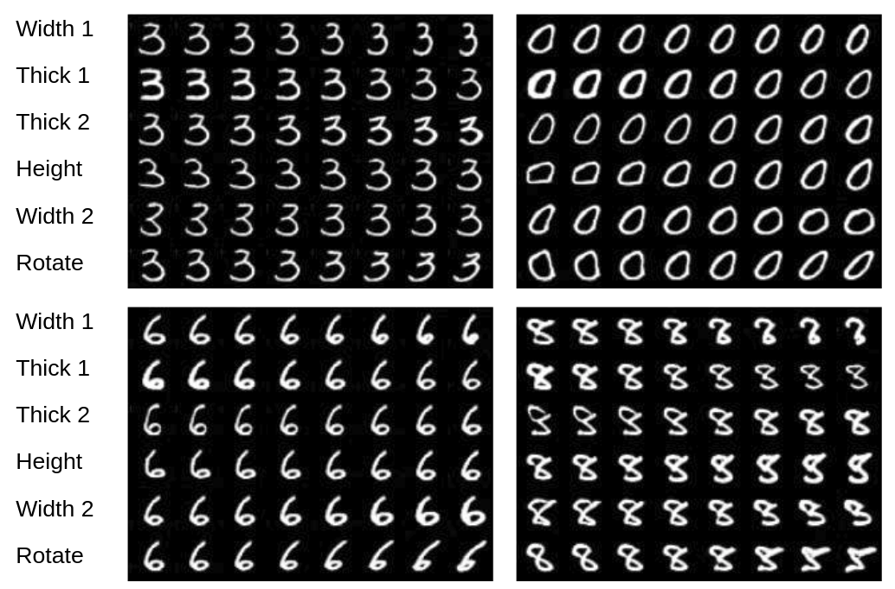
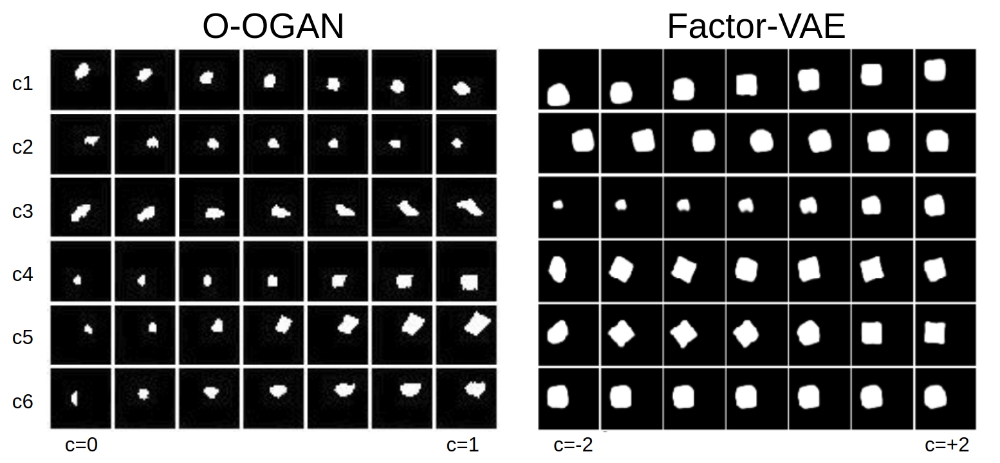

# OOGAN-pytorch
Pytorch implementation of the paper: [OOGAN: Disentangling GAN with One-Hot Sampling and Orthogonal Regularization](https://arxiv.org/abs/1905.10836)

Model overview:


# OOGAN based on vanilla GAN

1. code to define the networks: oogan_models.py, oogan_modules.py
2. to train the model on your data, first prepare your images inside a root folder with subfolders containing your images, then edit the "config.py" for all hyperparameter settings, templetes are provided inside, 
   then run 
    ```shell
    python train.py
    ```  
   the training will print log on terminal, and save the generated models and images during training.  
3. to generate images from trained model, first edit the model path in "generate.py", then run:
   ```shell
   python generate.py
   ```
   
   
# Train results
On celebA:


On 3D chair:




On MNIST:


On dSprite:



# OOGAN based on styleGAN
This implementation is based on the stylegan implementation from [here](https://github.com/rosinality/style-based-gan-pytorch),
please refer to that repo for updated code and usage.

1. code: ./oogan_stylegan/oo_stylegan_train.py, 
         ./oogan_stylegan/oo_stylegan_modules.py
2. to train the model on your data
   ```shell
   python oo_stylegan_train.py /path/to/image_root
   ```  
   the training will print log on terminal and save the generated models and images during training.
